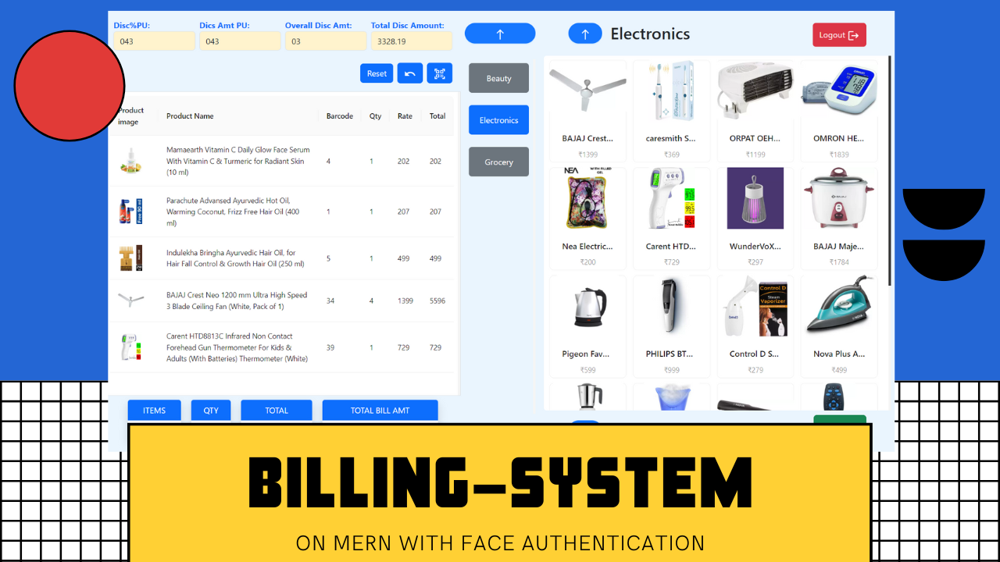
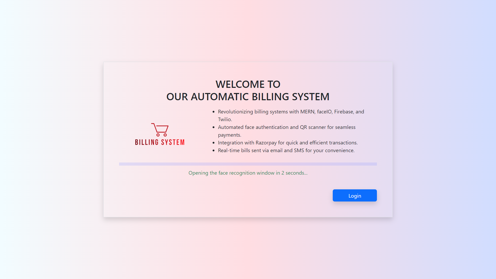
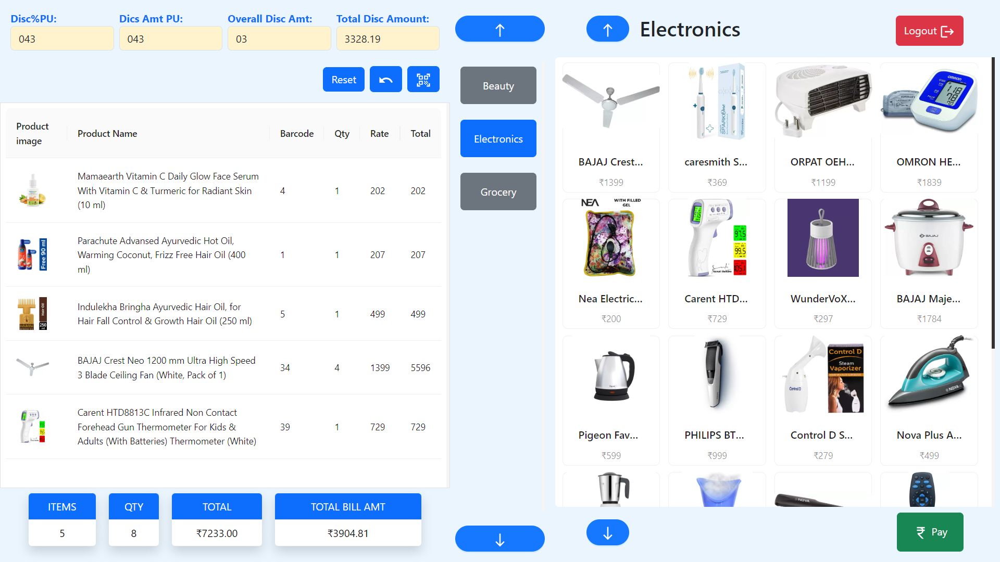
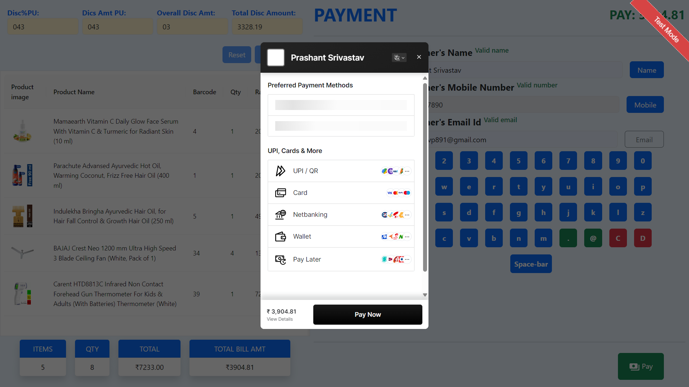
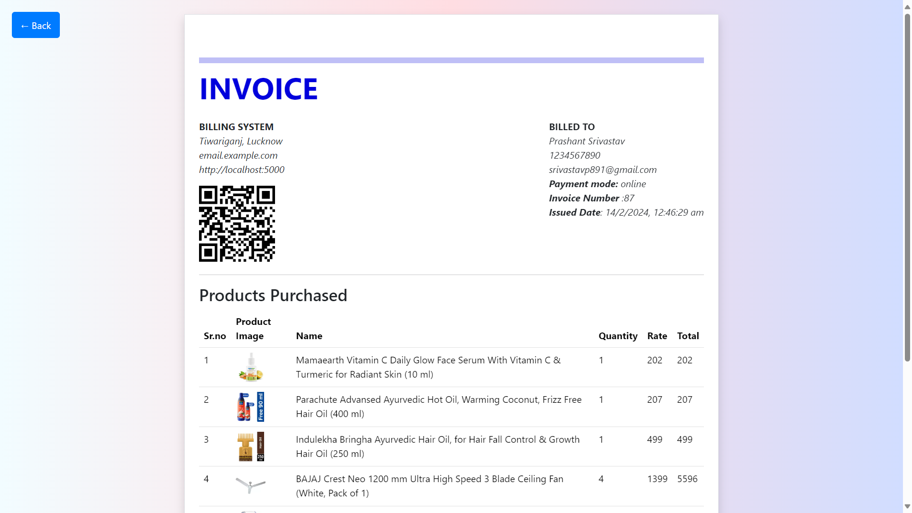
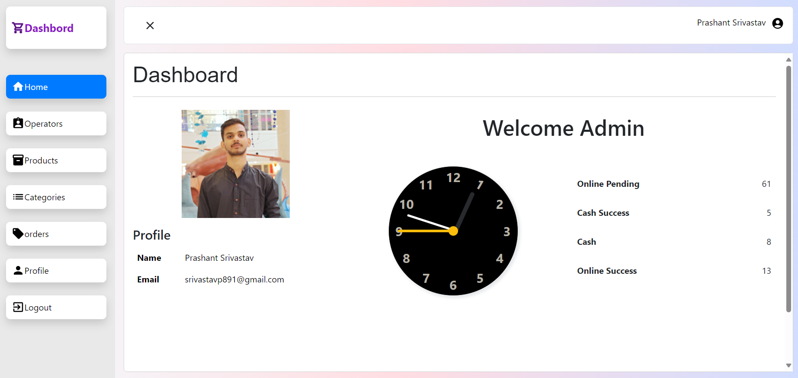

# Face Authenticated Billing System

## Overview

This project aims to provide a comprehensive billing system with advanced authentication features. Authentication is done using facial recognition technology, allowing users to log in to the dashboard as either an admin or an operator. Once logged in, users can perform their respective tasks, such as managing invoices, processing payments, and accessing other billing-related features.


## Technologies Used

### Billing System Server

- Express.js
- MongoDB (with Mongoose)
- Bcrypt.js
- CORS
- Dotenv
- Jsonwebtoken
- Nodemailer
- Nodemon
- Razorpay

### Billing System Frontend

- React.js
- Ant Design (antd)
- Axios
- Bootstrap
- Firebase
- HTML5-QRCode
- QRCode.react
- React Router DOM
- React Webcam
- Styled Components

## Installation

### Billing System Server

```
npm install express mongoose bcryptjs cors dotenv jsonwebtoken nodemailer nodemon razorpay
```

### Billing System Frontend
```
cd billing-system
npm install @emotion/react @emotion/styled @faceio/fiojs @mui/icons-material @mui/material @testing-library/jest-dom @testing-library/react @testing-library/user-event antd axios bootstrap firebase html5-qrcode qrcode.react react-router-dom react-spinners react-webcam styled-components web-vitals
```

## Usage

### To run the backend server:
```
node index.js
```
`OR`
```
nodemon index.js
```
### To start the frontend development server:
```
npm start
```

## Environment Variables

The following environment variables need to be set in a `.env` file at the root of the backend server directory:

- `MONGO_URL`: MongoDB connection string.
- `MONGO_DATABASE`: MongoDB database name
- `JWT_SECRET`: Secret key for JSON Web Token authentication.
- `RAZORPAY_KEY_ID`: Razorpay API Key ID.
- `RAZORPAY_SECRET_KEY`: Razorpay API Key Secret.
- `EMAIL`: Username for sending emails (if using Nodemailer).
- `EMAIL_PASSWORD`: Password for sending emails (if using Nodemailer).
- `PUBLIC_DOMAIN`: Public hosted domain of the site (in development use localhost:3000 || port)

Ensure to set these variables with appropriate values before running the server.

For the frontend application, the following environment variables need to be set:

- `REACT_APP_BASE_URL`: Base URL of the backend server.
- `REACT_APP_PUBLIC_ID`: Public ID for Face ID API.
- `REACT_APP_FACE_ID_API`: API key for Face ID API.
- `REACT_APP_FIREBASE_API_KEY`: Firebase API key.
- `REACT_APP_FIREBASE_AUTH_DOMAIN`: Firebase authentication domain.
- `REACT_APP_FIREBASE_PROJECT_ID`: Firebase project ID.
- `REACT_APP_FIREBASE_STORAGE_BUCKET`: Firebase storage bucket.
- `REACT_APP_FIREBASE_MESSAGING_SENDER_ID`: Firebase messaging sender ID.
- `REACT_APP_FIREBASE_APP_ID`: Firebase application ID.
- `REACT_APP_RAZORPAY_KEY_ID`: Razorpay API Key ID.

Ensure to set these variables with appropriate values before starting the frontend development server.


## Features

### 1. Facial Recognition Authentication
   - Users can log in using facial recognition technology.
   - Secure authentication process ensures access control to the dashboard.
   - Admin and operator roles are distinguished based on facial authentication.

### 2. Dashboard Access
   - Upon successful authentication, users are granted access to the dashboard.
   - Admins and operators have access to specific features and functionalities tailored to their roles.

### 3. Invoice Management
   - Users can manage invoices efficiently through the dashboard.
   - Create, view, update, and delete invoices as needed.

### 4. Payment Processing
   - Process payments seamlessly within the billing system.
   - Integration with Razorpay API for secure payment transactions.

### 5. Email Notifications
   - Receive email notifications for important updates, such as invoice status changes or payment confirmations.
   - Nodemailer integration enables automated email notifications.

### 6. Real-time Updates
   - Stay informed with real-time updates on invoice statuses and payment processing.
   - WebSocket integration for instant updates without page refresh.

### 7. Responsive Design
   - Enjoy a seamless user experience across devices with a responsive design.
   - Mobile-friendly interface ensures accessibility from anywhere.

### 8. QR Code Generation
   - Generate QR codes for invoices or payment requests.
   - HTML5-QRCode library integration for easy QR code generation.

### 9. Face ID API Integration
   - Integration with Face ID API for robust facial recognition capabilities.
   - Secure and reliable authentication process using facial biometrics.

### 10. Firebase Integration
   - Utilize Firebase services for enhanced authentication and data storage capabilities.
   - Firebase integration ensures scalability, reliability, and security.

### 11. Stylish UI Components
   - Enhance user experience with stylish UI components from Ant Design (antd) and Material-UI.
   - Bootstrap integration for additional styling and layout options.

### 12. Continuous Deployment
   - Implement continuous deployment practices for seamless updates and deployments.
   - Automated deployment pipelines ensure efficiency and reliability.

### 13. Customizable Settings
   - Customize settings and configurations to adapt to specific business requirements.
   - Environment variable support for easy configuration management.

### 14. Scalable Architecture
   - Built on scalable architecture to accommodate growing business needs.
   - Express.js backend and React.js frontend ensure scalability and flexibility.

### 15. Developer-Friendly
   - Developer-friendly codebase with well-documented APIs and modular components.
   - Easy to understand and extend for future enhancements and customizations.


# Project Process: From Inception to Completion

## Project Inception
The idea for the Facial Authenticated Billing System project stemmed from a desire to integrate cutting-edge authentication technology into a billing system. The initial brainstorming sessions involved exploring various authentication methods, ultimately leading to the decision to implement facial recognition.

## Getting Started
The project began with thorough research into facial recognition technology and its integration with web applications. This involved studying libraries and APIs available for facial recognition, as well as understanding the security implications and user experience considerations.

## Development Phase
During the development phase, the team divided tasks between backend and frontend development. Setting up the Express.js server and MongoDB database was relatively straightforward, thanks to prior experience with these technologies. However, integrating facial recognition into the authentication process posed a significant challenge.

## Struggles and Challenges
One of the main struggles encountered was finding a reliable facial recognition API that met the project requirements. Additionally, fine-tuning the facial recognition algorithm to achieve high accuracy and security without compromising user experience proved to be a complex task. Debugging issues related to API integrations and ensuring compatibility across different devices added to the development time.

## Overcoming Challenges
To overcome the challenges, the team collaborated closely, conducting regular code reviews and brainstorming sessions. Consulting documentation and seeking help from online communities, such as developer forums and Stack Overflow, also proved invaluable. Through perseverance and experimentation, the team was able to overcome most obstacles and make steady progress.

## Conclusion and Reflections
Despite the challenges faced during the development process, completing the Facial Authenticated Billing System project was a rewarding experience. The project not only provided valuable insights into the practical implementation of facial recognition technology but also highlighted the importance of teamwork, adaptability, and perseverance in overcoming obstacles. Moving forward, the team plans to continue refining the system, addressing any remaining issues, and exploring opportunities for further innovation.

## Lessons Learned
- Thorough research and planning are essential before embarking on a project involving new technologies or concepts.
- Collaboration and communication are key to overcoming challenges and making progress, especially in complex development tasks.
- Flexibility and adaptability are crucial when faced with unexpected hurdles or changes in project requirements.

This narrative provides a holistic view of the project process, from inception to completion, highlighting the experiences, struggles, and lessons learned along the way. It offers insights into the development journey and the team's approach to overcoming challenges, ultimately leading to a successful project outcome.

# Previews
### Demo
- Demo video
[](https://www.youtube.com/watch?v=GIiLVh6gfsE)
### Images
- login

- operator


- payment



- bill

- admin dashboard
